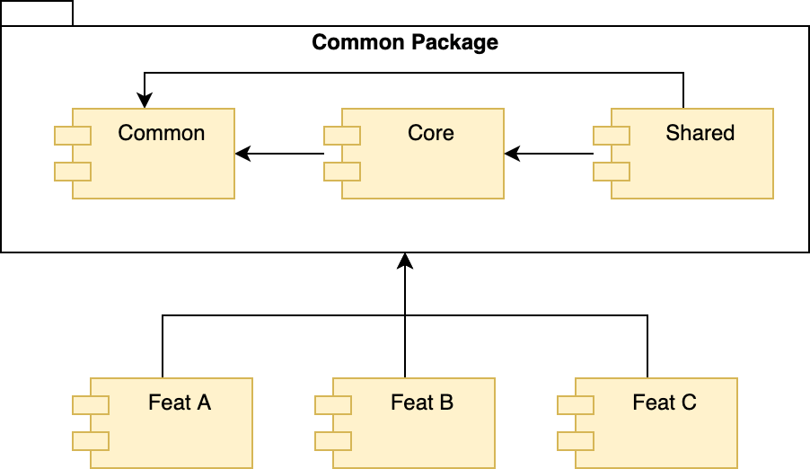

# Architecture: Folder Structure

본 문서는 아키텍처 운용 방법 중 `폴더 구조` 에 대하여 설명 합나다.



## Common Module

공용 모듈은 프로젝트 아키텍처를 위한 여러가지 공통 기능들이 모인 곳입니다.

이 모듈은 아래와 같은 구조를 가집니다.

<!--
/src/_modules
common
  components
  constants
  contexts
  hoc
  hooks
  networks
  proxies
  storage
  tracking
  types
  util
  validation
-->

```
/src/_modules
└── common
    ├── components
    ├── constants
    ├── contexts
    ├── hoc
    ├── hooks
    ├── networks
    ├── proxies
    ├── storage
    ├── tracking
    ├── types
    ├── util
    └── validation
```

한편 공용 모듈은 용도의 특성상, 기능 모듈과 구조는 비슷하나 약간의 차이점을 가집니다.

### 하부 폴더 및 파일 설명표

| 명칭    | 설명     |
| :----- | :------ |
| components | 특수한 기능을 가진 공용 컴포넌트 |
| constants | 공용 상수 선언부 |
| contexts | 특수 컴포넌트의 기능을 보조 할 컨텍스트 모음 |
| hoc | 공용 High-Order Component 모음 |
| hooks | 공용 hooks 모음 |
| networks | 네트워킹 처리 서비스 및 객체 모음 |
| proxies | 캐시나 로그등 프록시 패턴을 응용한 객체나 함수 모음 |
| storage | 캐싱을 위한 각종 스토리지를 만들고 제공하는 곳 |
| tracking | GA 나 Hotjar, Texonomy 등 트래킹 관련 기능을 정의 한 곳 |
| types | 공용 interface 나 type, enum 등을 선언하고 모아 놓음 |
| util | 공용 유틸리티 함수 모음 |
| validation | 유효성 체크 기능을 구현 한 곳 |

### 주의
특별한 사유가 없다면 기능 추가나 변경은 가급적 지양합니다.

일반적인 공용 UI 컴포넌트는 이 곳이 아니라 `design system` 부분을 참고 하여 추가 합니다.

## Core Module

프로젝트 내 업무에서 Backend Server 와 데이터를 주고받는 기능과 로직이 구현된 곳입니다.

<!--
/src/_modules
core
  entities
  graphql
  repositories
  networks.ts
  repo.ts
-->

```
/src/_modules
└── core
    ├── entities
    ├── graphql
    ├── repositories
    ├── networks.ts
    └── repo.ts
```

### 하부 폴더 및 파일 설명표

| 명칭    | 설명     |
| :----- | :------ |
| entities | 서버에서 정의한 Entity Model 을 작성하는 곳 |
| graphql | graphql 관련 내용이 작성된 곳 |
| repositories | 각종 모듈에서 사용될 레포지토리가 정의된 곳 |
| networks.ts | 레포지토리에서 쓰이는 네트워킹 객체가 정의된 곳 |
| repo.ts | 외부에서 레포지토리를 이용 시 진입점이 되는 곳 |

## Shared Module

프로젝트 내에서 공통으로 사용되나 복잡도가 높은 하나의 업무 기능이 구현된 곳입니다.

가령 로그인이나 인증, 스크래핑 등의 기능이 포함될 수 있습니다.

<!--
/src/_modules
shared
  components
  constants
  containers
  models
  stores
  services
  utils
  {subFeatureModule}
  index.ts
  reducers.ts
-->

```
/src/_modules
└── shared
    ├── components
    ├── constants
    ├── containers
    ├── models
    ├── stores
    ├── services
    ├── utils
    ├── {subFeatureModule}
    ├── index.ts
    └── reducers.ts
```

### 하부 폴더 및 파일 설명표

| 명칭    | 설명     |
| :----- | :------ |
| components | 각종 표현 컴포넌트가 구현된 곳 | 
| constants | 현재 기능 모듈내에서만 쓰이는 각종 상수 모음 |
| containers | 스마트 컴포넌트가 구현된 곳 |
| models | 현재 모듈에서 쓰일 `UI Model` 을 선언한 곳 |
| store | redux-toolkit 을 이용한 각종 스토어 관련 기능들 |
| service | 기능 모듈내 비즈니스 로직 구현 시 필요한 클래스나 객체 모음 |
| utils | 간단한 함수형 유틸리티들 |
| hooks | 컴포넌트에서 쓰이는 hooks 모음 |
| hoc | 컴포넌트에서 쓰이는 high-Order Component 모음 |
| index.ts | 공유 모듈 기능을 외부에서 접근하는 진입점 역할 |
| reducers.ts | store 내 reducer 들을 묶어서 외부에 공개 하는 역할 |

공유 모듈은 그 자체로 `공유되는 기능`에만 초점이 맞춰져 있으므로 별도 Page 나 Route 설정이 없음에 유의 바랍니다.

이들은 대체로 `완성된 형태`의 `Container` 를 제공하는 목적으로 구성 됩니다.

## Feature Module

기능 모듈은 일반적인 작업이 이뤄지는 장소 입니다.

이들은 아래와 같은 구조를 가집니다.

<!--
/src/_modules
moduleName
  components
  constants
  containers
  models
  pages
  store
  services
  utils
  hooks
  hoc
  reducers.ts
  routes.ts
-->

```
/src/_modules
└── moduleName
    ├── components
    ├── constants
    ├── containers
    ├── models
    ├── pages
    ├── store
    ├── services
    ├── utils
    ├── hooks
    ├── hoc
    ├── reducers.ts
    └── routes.ts
```

### 하부 폴더 및 파일 설명표

| 명칭    | 설명     |
| :----- | :------ |
| components | 각종 표현 컴포넌트가 구현된 곳 | 
| constants | 현재 기능 모듈내에서만 쓰이는 각종 상수 모음 |
| containers | 스마트 컴포넌트가 구현된 곳 |
| models | 현재 모듈에서 쓰일 `UI Model` 을 선언한 곳 |
| pages | 페이지 컴포넌트가 구현된 곳 |
| store | redux-toolkit 을 이용한 각종 스토어 관련 기능들 |
| service | 기능 모듈내 비즈니스 로직 구현 시 필요한 클래스나 객체 모음 |
| utils | 간단한 함수형 유틸리티들 |
| hooks | 컴포넌트에서 쓰이는 hooks 모음 |
| hoc | 컴포넌트에서 쓰이는 high-Order Component 모음 |
| reducers.ts | store 내 reducer 들을 묶어서 외부에 공개 하는 역할 |
| routes.ts | 현재 기능 모듈이 실제 수행 될 라우트 설정 |

각 하부 폴더와 파일은 모든게 필수는 아니며, 필요 시 만들어 사용합니다.

이들 기능 모듈은 작업자가 상기 폴더 구조와 코딩/파일명 규칙을 유지한 채로 내부 구현은 자유롭게 진행 합니다.

단, 특정 기능 모듈에서 작업 중 만들어지는 유틸리티나 서비스 함수등은 이 곳에만 두고 사용합니다.
