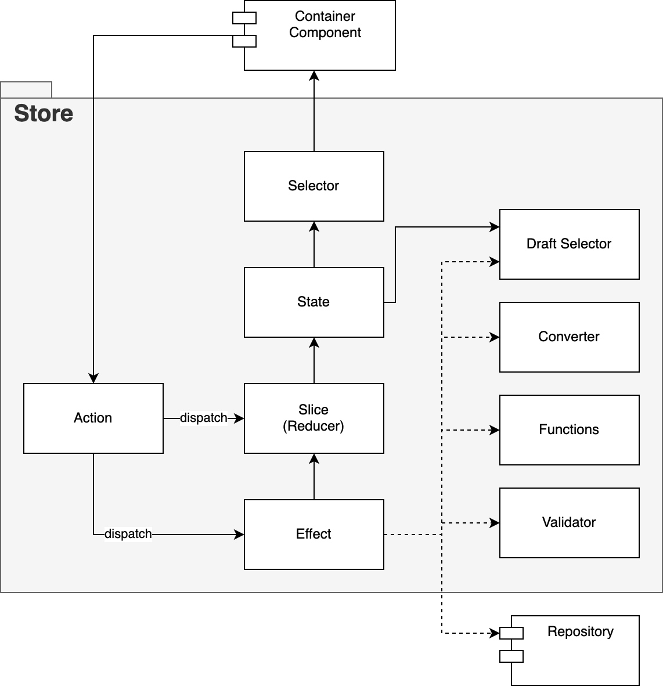

# Architecture: Stores

Redux 스토어 작성 시 알아두면 좋을 사전 지식과 필요한 규칙을 다룹니다.

## 스토어의 배경

스토어는 Flux Architecture 에서 고안된 개념입니다.

이는 UI 영역에서 빈번하게 이루어지는 상태 관리를 특정 관리자(State Manager)가 관리하는 형태가 만들어지는 것이 그 시작이라 볼 수 있습니다.

이 때 데이터는 일종의 Database 로 취급되며 관리자는 상태 데이터를 다룸에 있어 DBMS(Database Management System)의 역할을 수행하게 됩니다.

한편 사용자와 상호작용을 맡는 View 는 관리자가 제공하는 상태값을 단순히 받아서 이용하게 됩니다.

### 부분별 목적

스토어는 다양한 구성요소를 가지고 있습니다.

기본적으로 `reducer`, `action`, `effect`, `selector` 를 가질 수 있습니다.

이 중 effect 나 selector 는 자료를 조작하거나 제공하는 주체이기에 많은 경우, 그 기능이 복잡 해 질 수 있습니다.

```ts
// 단순한 이펙트 예시
export const effChooseUserFavoriteThings = createAsyncThunk(async (payload) => {
  const res = await repo.user.favorites(payload.userFavorite);

  return res;
});
```

복잡해 질 경우 다음과 같이 코드가 길어지고 가독성이 떨어지게 됩니다.

```ts
// 기능이 복잡한 이펙트 예시
export const effChooseUserFavoriteThings = createAsyncThunk<
  UserFavoriteThingUiModel[],
  ChooseUserFavorite,
  { state: RootState }
>(async (payload, api) => {
  try {
    const res = await repo.user.favorites(payload.userFavorite);

    const items = res.data.map(item => ({
      idx: item.idx,
      address: item.info.address.detail,
      price: item.prod
        ? item.prod.basePrice
        : item.alt.sales.price * AMOUNT_PRICE_DICTIONARY[item.alt.key],
    }));

    const file = await loadFiles(payload.userAuth.idx);


    const prmReader = new Promise((resolve, reject) => {
      const reader = new FileReader();

      reader.onSuccess = () => {
        resolve(reader.getData());
      };
      reader.onFail = (error) => {
        reject(error)
      };
      reader.read(file);
    });

    const redData = await prmReader;

    // and so on...

    return res;
  } catch(error) {
    return api.rejectWithValue(error);
  }
});
```

이럴 때는 일반적으로 각 기능을 분리하여 이용하도록 리팩터링이 이루어집니다.

리팩터링의 사유는 보시다시피 `코드가 지나치게 길고 복잡하기 때문` 입니다.

이러한 코드의 복잡도를 줄이고 각 기능을 함수나 클래스로 모듈화 하여 코드 가독성을 높이고 관심사 분리를 이루고자 하는 것이 스토어내 기능 분리의 목적 입니다.

> 코드가 길어지면 오류의 확률이 높아집니다.
>
> 코드를 간결히 유지 하세요! - Keep It Simple, Stupid !
>
> KISS -

```ts
// 변경된 복잡한 이펙트
export const effChooseUserFavoriteThings = createAsyncThunk<
  UserFavoriteThingUiModel[],
  ChooseUserFavorite,
  { state: RootState }
>(async (payload, api) => {
  try {
    const res = await repo.user.favorites(payload.userFavorite);

    // Entity 를 View 에서 쓰일 Ui Model 로 바꿔주는 converter
    const items = toUserFavoriteThingUiModels(res.data);

    // 데이터 처리를 하는 functions
    const redData = await readExcelData(payload.userAuth);

    // 사용자의 입력 유효성을 체크하는 validate
    const validateResult = validatePayload(payload.userInput);

    // and so on...

    return res;
  } catch(error) {
    return api.rejectWithValue(error);
  }
});
```

## 다이어그램



## 구조

스토어는 특정 기능 모듈 (Feature Module) 내에 다음과 같은 구조를 가집니다.

<!--
# /src/_modules
## moduleName
### stores
#### moduleName.slice.ts
#### moduleName.effect.ts
#### moduleName.create.ts
#### moduleName.converter.ts
#### moduleName.funcs.ts
#### moduleName.validate.ts
#### moduleName.selector.ts
### reducers.ts
-->
```
/src/_modules
  └── moduleName
      ├── stores
      │   ├── moduleName.slice.ts
      │   ├── moduleName.effect.ts
      │   ├── moduleName.create.ts
      │   ├── moduleName.converter.ts
      │   ├── moduleName.funcs.ts
      │   ├── moduleName.validate.ts
      │   └── moduleName.selector.ts
      └── reducers.ts
```
## 파일명

스토어는 여러가지 파일로 나뉘어 역할을 수행하는데 그 종류와 파일명 규칙은 다음과 같습니다.

| type | rule   | example |
| :--- | :----- | :------ |
| slice | {feat}.slice.ts | cashFlow.slice.ts |
| effect | {feat}.effect.ts | cashFlow.effect.ts |
| create | {feat}.create.ts | cashFlow.create.ts |
| converter | {feat}.converter.ts | cashFlow.converter.ts |
| functions | {feat}.funcs.ts | cashFlow.funcs.ts |
| validate | {feat}.validate.ts | cashFlow.validate.ts |
| selector | {feat}.selector.ts | cashFlow.selector.ts |

## 역할

스토어는 아래와 같은 부분으로 나뉘어 각자의 역할을 수행합니다.

| type | desc |
| :--- | :--- |
| slice | 리듀서를 총괄하고 스토어의 상태를 간직하여 액션 결과에 대하여 상태를 최종 변경하는 역할.<br />필요에 따라 normal action 을 구성할 수 있다. |
| effect | 레포지토리를 이용해 데이터를 가져와서 조작하거나 각종 데이터 로직을 수행하여 reducer 에 전달 한다.<br />필요에 따라 effect 파일 내에 normal action 이 포함될 수 있다. |
| normal action | effect 와는 달리 단순히 payload 를 reducer 에 전달만 하는 역할.<br/>effect 수행 중 action 을 수행해야 할 때 쓰인다. |
| slice action | slice 가 자체적으로 가지는 액션.<br/>slice 의 `reducer` 속성 내에 선언된다. |
| create | UI Model 이나 DTO 를 만드는 팩토리 함수들. |
| converter | 서버에서 전달된 Entity 를 UI Model 로 변환, 혹은 서버에 전달 목적으로 역변환을 수행한다.<br />또는 로직 수행 중 필요한 각종 변환을 담당한다. |
| functions | effect 나 converter, selector 에서 쓰이는 하위 함수가 포함된다.<br/>이 들은 주로 데이터 로직이나 비즈니스 로직으로 이뤄져 있다. |
| validate | 유효성 검사를 담당하는 역할. |
| selector | 스토어 내 상태값 중 업무에 필요한 것만 적절히 걸러주는 역할.<br />Page 나 Container 컴포넌트에서 쓰인다. |
| draft selector | selector 와 동일하나 effect 나 slice 내부에서만 쓰이는 것이 다르다. |


### reducers.ts

기능 모듈을 외부에 공개 할 때 `router` 와 `store` 만을 노출 시킵니다.

이 파일은 그 중 `store` 에 해당되는 것으로서 작성된 `slice` 를 아래와 같이 조합하여 export 해 줍니다.

```ts
// 작성 예시 (shared module)
import { combineReducers } from 'redux';
import { userSlice, scrapingSlice } from './stores';

export const sharedReducers = combineReducers({
  user: userSlice.reducer,
  scraping: scrapingSlice.reducer
});

```

## 변수명

| type | prefix | example | ref. |
| :--- | :----- | :------ | :--- |
| effect | eff | effFetchUserInfo, effUpdateProdDetail | |
| normal action | act | actDeleteItem, actChangeAuthInfo | effect 내에 포함되는 액션.<br/>slice 자체적으로 구성된 액션은 해당되지 않음. |
| selector | sel | selAuthorities, selProductItems | createSelector 로 만들어진 memoize 가 가능한 셀렉터 |
| draft selector | drf | drfCorpNames, drfCustomerAddress | 데이터 로직 진행중 수행되는 셀렉터.<br />createDraftSafeSelector 로 만들어진다. |

## 허용

스토어는 일반적으로 다음과 같은 행위를 허용합니다.

- utility 사용 가능.
- service 사용 가능. 단, 데이터 로직이나 파일처리 등에 한함.

## 제약

스토어는 프론트엔드 영역에서 비즈니스 로직과 데이터 처리를 담당하는 곳으로써 아래와 같은 제약을 가집니다.

- JSX 나 React 등 View 와 관련된 코드를 직접적으로 호출할 수 없음.
  - 만약 toast 나 modal 에 부득이하게 넣어야 한다면 별도 service 를 구성하여 호출 할 것.
- 외부 모듈에서 다른 모듈 내 스토어를 직접 참조하는 것은 지양한다.
  - 예를들어 selector 로 다른 모듈의 상태를 가져오기 위함이라면, 사용이 필요한 모듈쪽에서 selector 만 자체적으로 구성하여 사용한다.
  - 단, sub module 끼리는 허용되나 circular dependency 에 유의한다.
- repository 나 데이터 로직이 없는 단순 payload 를 넘기는 effect 는 작성하지 아니 한다.
  - 이런 경우는 normal action 이나 slice action 이용.
- funcs 는 스토어 내부에서만 사용해야 한다.
  - 모듈 내 유틸리티나 컴포넌트에서 사용하는 것

## 요령

단위 테스트는 필수적이진 않습니다.

다만, 스토어 구성 요소 를 jest 로 테스트 할 때는 `funcs` 나 `converter` 같은 기능들이 주요 대상 입니다.

가능한 한 복잡한 로직은 funcs 나 converter 로 분리하여 effect 에서 수행하게 작성 합니다. 🙂